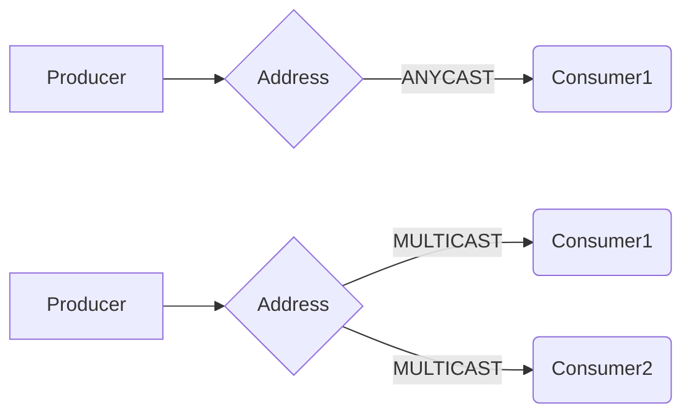
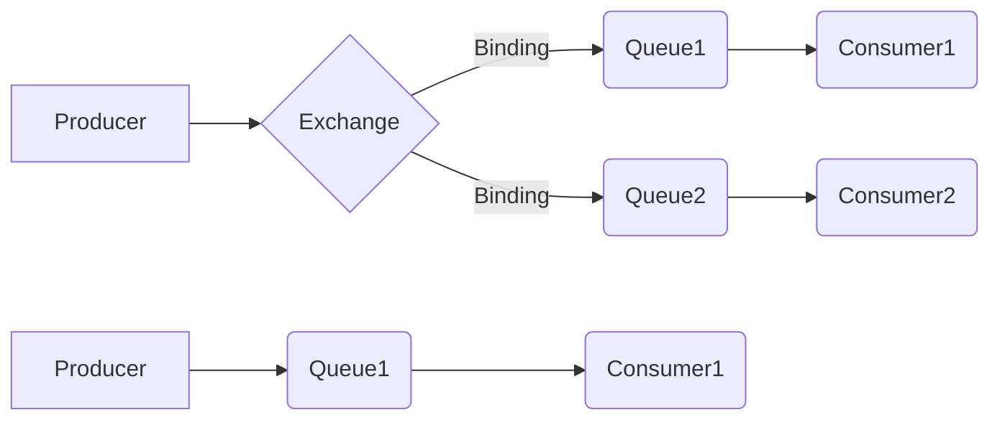
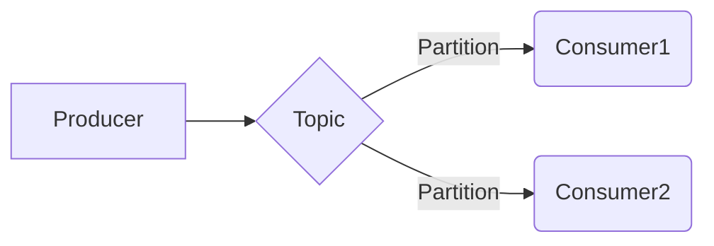
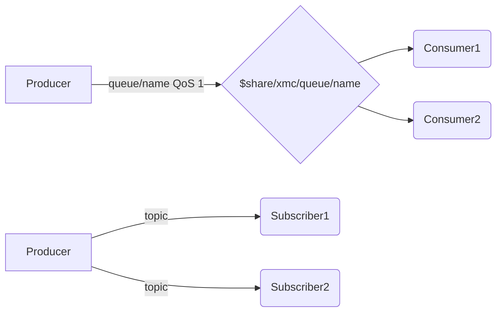
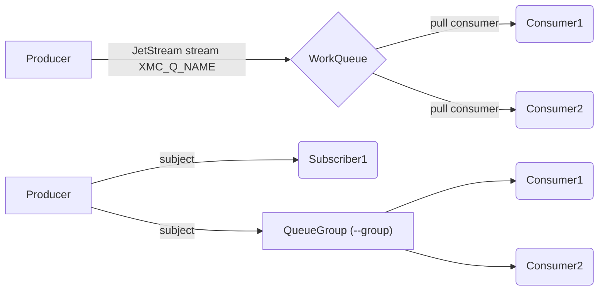
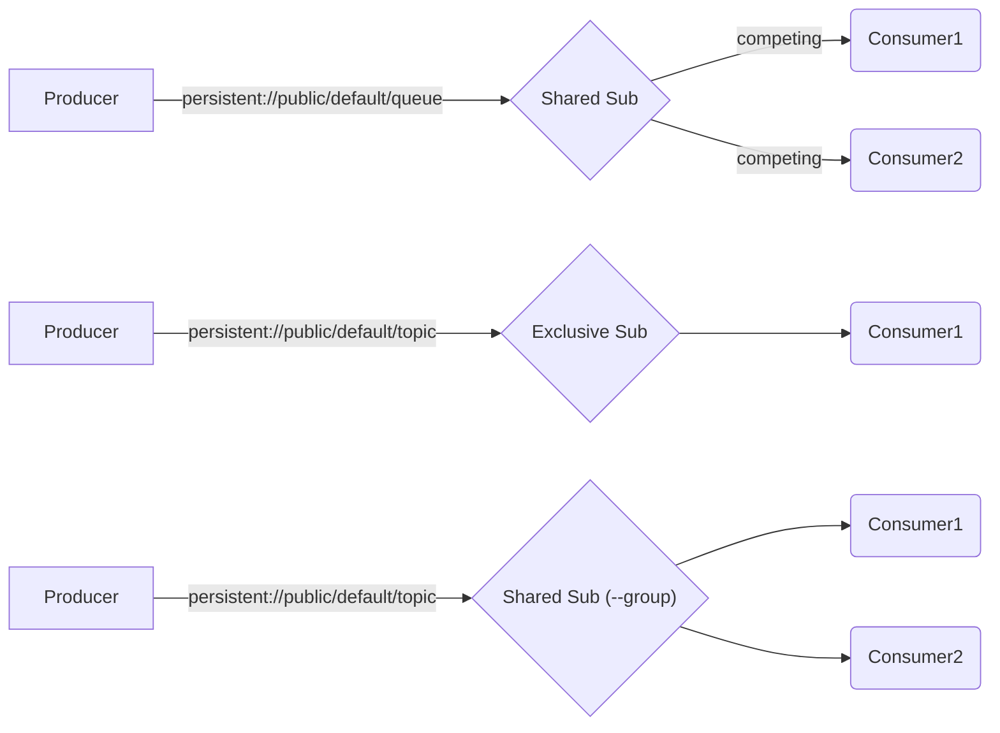

# Differences Between Brokers

## Feature Matrix

| Feature | Artemis | RabbitMQ | Kafka | IBM MQ | MQTT | NATS | Pulsar |
| --- | --- | --- | --- | --- | --- | --- | --- |
| Queue send/receive/peek | Yes | Yes | - | Yes | Yes | Yes | Yes |
| Topic publish/subscribe | Yes | Yes | Yes | - | Yes | Yes | Yes |
| Request-reply | Yes | Yes | - | Yes | - | Yes | Yes |
| TLS / SSL | Yes | Yes | Yes | - | Yes | Yes | Yes |
| Message selectors | Yes | Yes | - | Yes | - | - | - |
| Durable subscriptions | Yes | Yes | - | - | - | - | Yes |
| TTL / expiry | Yes | Yes | Yes | Yes | - | - | Partial |
| Application properties | Yes | Yes | Yes | Yes | - | - | Yes |
| Message priority | Yes | Yes | - | Yes | - | - | - |
| Persistent delivery | Yes | Yes | - | Yes | Yes (QoS 1) | Yes (JetStream) | Yes (persistent://) |
| Management: list | Yes | Yes | Yes | - | - | Yes | Yes |
| Management: purge | Yes | Yes | - | - | - | - | - |
| Management: stats | Yes | Yes | - | - | - | - | - |

## Traditional Message Brokers

### Apache Artemis

- Protocol: AMQP 1.0
- Creates queues on the fly (e.g. when a consumer connects)
- ANYCAST means traditional queues (default), only one consumer
- MULTICAST means topics & subscriptions, multiple consumers
- Selectors: Full JMS selector support via AMQP source filters
- Management: Jolokia REST API on HTTP port 8161

=> Use message metadata for topology selection.

### RabbitMQ

- Protocol: AMQP 1.0 (RabbitMQ v4+)
- Choose between exchange/queue model (also for topics & subscriptions) and simple queue model
- Choose between `fanout`, `direct`, `topic` and `headers` exchange types
- Topics use exchange-based routing (default exchange: `amq.topic`, configurable via `--exchange/-e`)
- Selectors: Supported via AMQP source filters
- Management: RabbitMQ Management API on HTTP port 15672 (list, purge, stats)

=> Define topology statically by declaring exchanges, queues, and bindings.

### IBM MQ

- Protocol: IBM MQ native (requires IBM MQ client libraries)
- Queue-only operations (no topic support in imc)
- Binary name: `imc` (built via `build-imc-in-container.sh` or with `-tags ibmmq`)
- Connection flags include `--qmgr/-m` (queue manager) and `--channel/-c`
- Selectors: IBM MQ message selector support
- TTL: Uses MQMD Expiry field (tenths of a second, converted from ms)
- No management commands (use IBM MQ Explorer or `runmqsc`)
- Build requires IBM MQ SDK/client libraries (platform-specific)

## Streaming Brokers

### Kafka

- Protocol: Kafka native
- Has its own concepts & domain language, which differs from traditional
  messaging and Enterprise Integration Patterns (EIP)
- Always uses topics, no queues
- Always persists messages, ability to replay messages
- TTL: Set as a message header (broker-side retention handles expiry)
- Consumer groups for parallel processing (`--group/-g`)
- Message keys for partitioning (`--key/-K`)
- Management: Topic listing via admin client (no purge/stats)

### MQTT

- Protocol: MQTT 3.1.1 / 5.0
- Binary: `mmc`, build tag: `mqtt`
- **Queue topology**: send publishes to `queue/{name}` with QoS 1; receive uses MQTT 5.0 shared subscriptions (`$share/xmc/queue/{name}`) for competing consumers; peek subscribes directly without a shared subscription using a fresh clean-session client.
- **Topic topology**: publish/subscribe to MQTT topics directly. Consumer groups via `--group` map to shared subscriptions (`$share/{groupID}/{topic}`).
- TLS: auto-detected via `ssl://` URL scheme or `--tls` flag
- `--client-id` flag: optional, auto-generated if not set
- QoS 0 = non-persistent, QoS 1 = persistent (maps to `--persistent` flag)
- Default server: `tcp://localhost:1883` (env: `MMC_SERVER`)
- Library: `github.com/eclipse/paho.mqtt.golang`

### NATS

- Protocol: NATS Core / JetStream
- Binary: `nmc`, build tag: `nats`
- **Queue topology**: JetStream streams with WorkQueue retention — each message delivered to exactly one consumer. Streams are auto-created on first use (`XMC_Q_{QUEUENAME}`). Peek uses a pull consumer with nak (no acknowledgement) so messages are not consumed.
- **Topic topology**: Core NATS pub/sub subjects. Consumer groups via `--group` flag map to NATS queue subscribers (`QueueSubscribeSync`).
- Request-reply: supported using NATS reply subjects
- TLS: standard flags (`--tls`, `--ca-cert`, `--cert`, `--key-file`, `--insecure`)
- Management: `manage list` enumerates JetStream streams (= queues)
- Default server: `nats://localhost:4222` (env: `NMC_SERVER`)
- Requires JetStream enabled on the server (`--jetstream` flag or `jetstream {}` in server config) for queue operations
- Library: `github.com/nats-io/nats.go`

### Apache Pulsar

- Protocol: Pulsar native (binary protocol, port 6650)
- Binary: `pmc`, build tag: `pulsar`
- **Queue topology**: Shared subscription on `persistent://public/default/{queue}` — messages distributed among all subscribers with the same subscription name, each delivered to exactly one consumer.
- **Topic topology**: Exclusive subscription by default (single consumer gets all messages); `--group` maps to Shared subscription for load-balanced consumer groups.
- Durable subscriptions: all subscriptions are durable by default in Pulsar (server retains messages until acknowledged)
- Peek: uses Shared subscription + Nack so messages are redelivered and not consumed
- Request-reply: via ReplyTo topic property
- TLS: auto-detected via `pulsar+ssl://` URL scheme; also `--tls` flag
- Authentication: token-based via `--password` (JWT); TLS client certificate via `--cert`/`--key-file`
- Management: `pmc manage list` uses Pulsar Admin REST API (HTTP port 8080, `--admin-port` to override)
- Default server: `pulsar://localhost:6650` (env: `PMC_SERVER`)
- Tenant/namespace: defaults to `persistent://public/default/`

