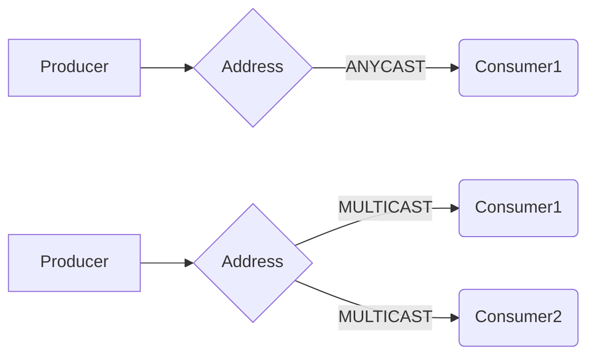
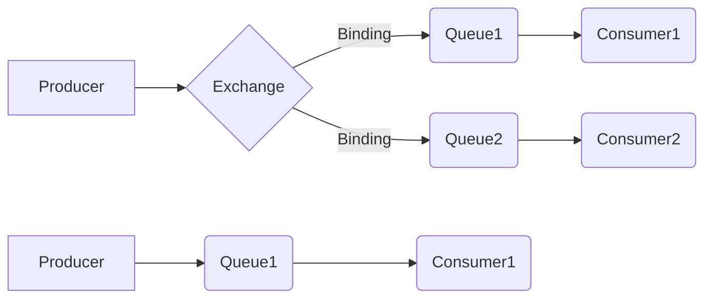
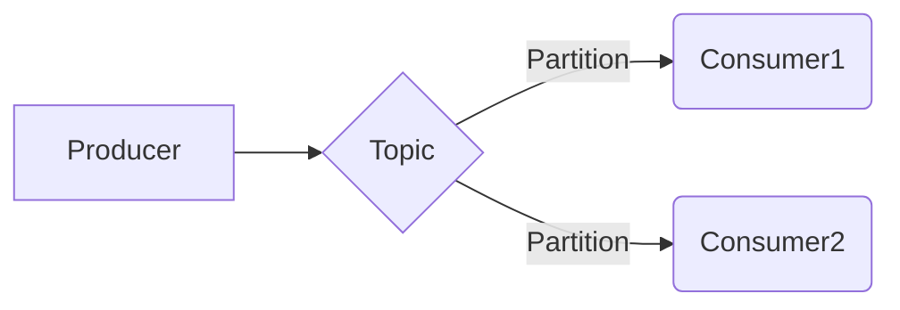

# Differences Between Brokers

## Feature Matrix

| Feature | Artemis | RabbitMQ | Kafka | IBM MQ | MQTT |
| --- | --- | --- | --- | --- | --- |
| Queue send/receive/peek | Yes | Yes | - | Yes | - |
| Topic publish/subscribe | Yes | Yes | Yes | - | Yes |
| Request-reply | Yes | Yes | - | Yes | - |
| TLS / SSL | Yes | Yes | Yes | - | Yes |
| Message selectors | Yes | Yes | - | Yes | - |
| Durable subscriptions | Yes | Yes | - | - | - |
| TTL / expiry | Yes | Yes | Yes | Yes | - |
| Application properties | Yes | Yes | Yes | Yes | - |
| Message priority | Yes | Yes | - | Yes | - |
| Persistent delivery | Yes | Yes | - | Yes | - |
| Management: list | Yes | Yes | Yes | - | - |
| Management: purge | Yes | Yes | - | - | - |
| Management: stats | Yes | Yes | - | - | - |

## Traditional Message Brokers

### Apache Artemis

- Protocol: AMQP 1.0
- Creates queues on the fly (e.g. when a consumer connects)
- ANYCAST means traditional queues (default), only one consumer
- MULTICAST means topics & subscriptions, multiple consumers
- Selectors: Full JMS selector support via AMQP source filters
- Management: Jolokia REST API on HTTP port 8161

=> Use message metadata for topology selection.

### RabbitMQ

- Protocol: AMQP 1.0 (RabbitMQ v4+)
- Choose between exchange/queue model (also for topics & subscriptions) and simple queue model
- Choose between `fanout`, `direct`, `topic` and `headers` exchange types
- Topics use exchange-based routing (default exchange: `amq.topic`, configurable via `--exchange/-e`)
- Selectors: Supported via AMQP source filters
- Management: RabbitMQ Management API on HTTP port 15672 (list, purge, stats)

=> Define topology statically by declaring exchanges, queues, and bindings.

### IBM MQ

- Protocol: IBM MQ native (requires IBM MQ client libraries)
- Queue-only operations (no topic support in imc)
- Binary name: `imc` (built via `build-imc-in-container.sh` or with `-tags ibmmq`)
- Connection flags include `--qmgr/-m` (queue manager) and `--channel/-c`
- Selectors: IBM MQ message selector support
- TTL: Uses MQMD Expiry field (tenths of a second, converted from ms)
- No management commands (use IBM MQ Explorer or `runmqsc`)
- Build requires IBM MQ SDK/client libraries (platform-specific)

## Streaming Brokers

### Kafka

- Protocol: Kafka native
- Has its own concepts & domain language, which differs from traditional
  messaging and Enterprise Integration Patterns (EIP)
- Always uses topics, no queues
- Always persists messages, ability to replay messages
- TTL: Set as a message header (broker-side retention handles expiry)
- Consumer groups for parallel processing (`--group/-g`)
- Message keys for partitioning (`--key/-K`)
- Management: Topic listing via admin client (no purge/stats)

### MQTT

- Protocol: MQTT 3.1.1 / 5.0
- Topic-only pub/sub model
- Lightweight protocol designed for IoT
- Stub implementation (not fully implemented)
