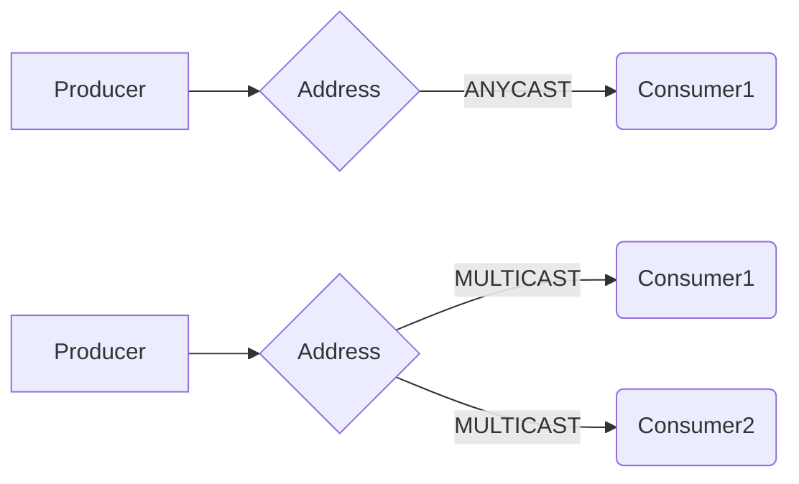
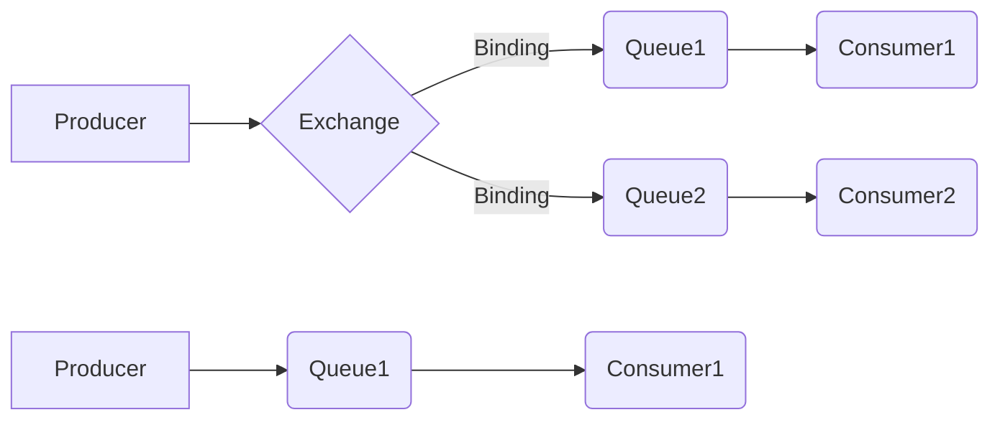
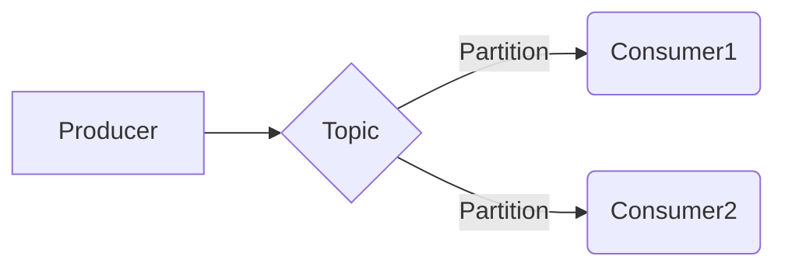

# Differences Between Brokers

## Traditional Message Brokers

### Amazon SQS

### Apache Artemis

- Creates queues on the fly (e.g. when a consumer connects)
- ANYCAST means traditional queues (default), only one consumer
- MULTICAST means topics & subscriptions (use `-m` flag), multiple consumers

=> Use message metadata for topology selection.

```mermaid
flowchart LR
    A[Producer] --> B{Address}
    B -->|ANYCAST| C(Consumer1)

    H[Producer] --> I{Address}
    I -->|MULTICAST| J(Consumer1)
    I -->|MULTICAST| K(Consumer2)
```

### Azure Service Bus

### RabbitMQ

- Choose between exchange/queue model (also for topics & subscriptions) and simple queue model
- Choose between `fanout`, `direct`, `topic` and `headers` exchange types

=> Define topology statically by declaring exchanges, queues, and bindings.

```mermaid
flowchart LR
    A[Producer] --> B{Exchange}
    B -->|Binding| C(Queue1) --> D(Consumer1)
    B -->|Binding| E(Queue2) --> F(Consumer2)

    H[Producer] --> I(Queue1) --> J(Consumer1)
```

## Streaming Brokers

### Kafka

- Has its own concepts & domain language, which differs from traditional
  messaging and Enterprise Integration Patterns (EIB)
- Always uses topics, no queues
- Always persists messages, ability to replay messages

```mermaid
flowchart LR
    A[Producer] --> B{Topic}
    B -->|Partition| C(Consumer1)
    B -->|Partition| D(Consumer2)
```
