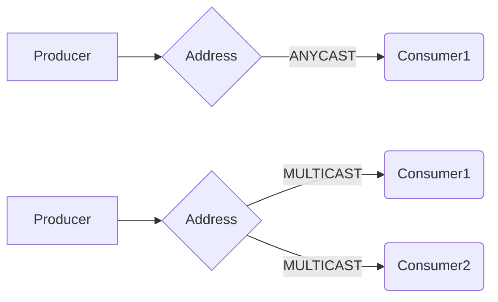
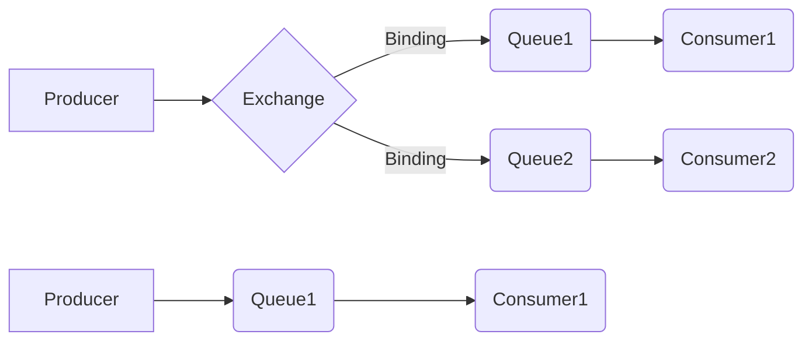
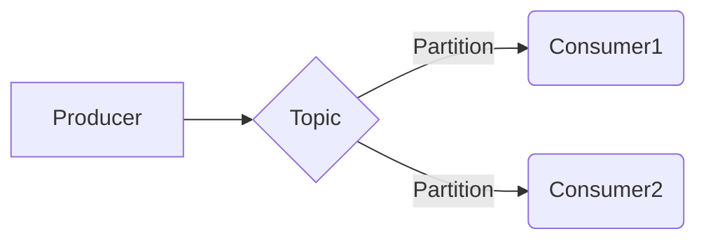
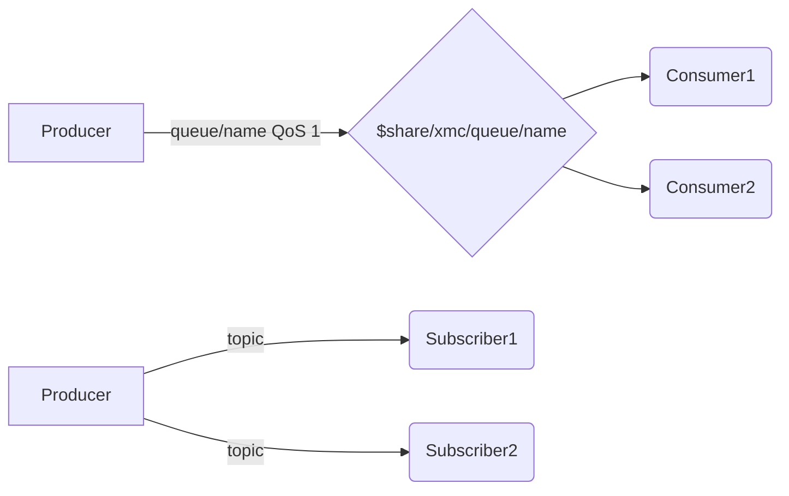
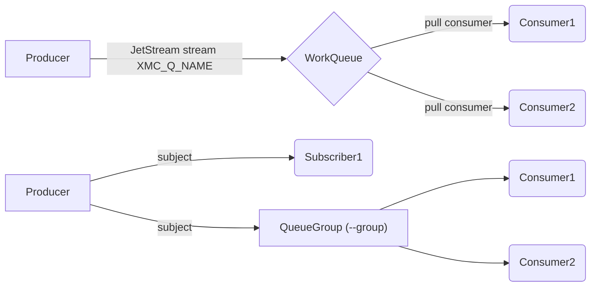
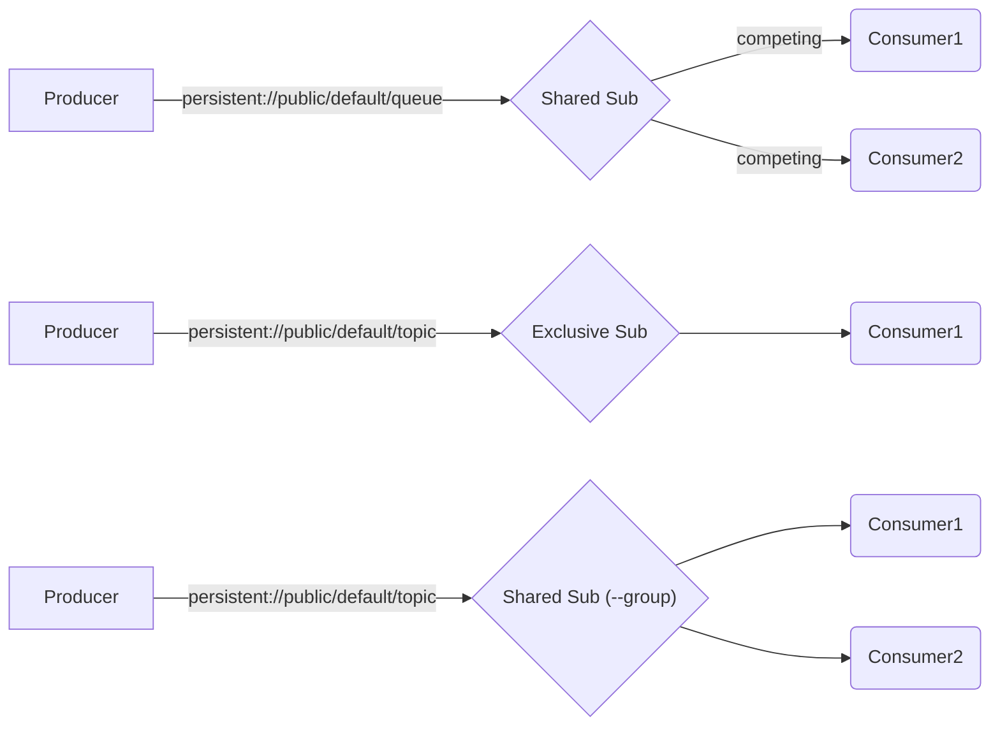
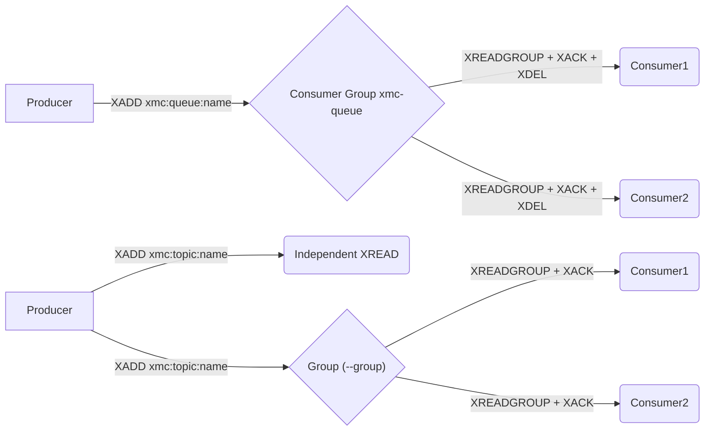
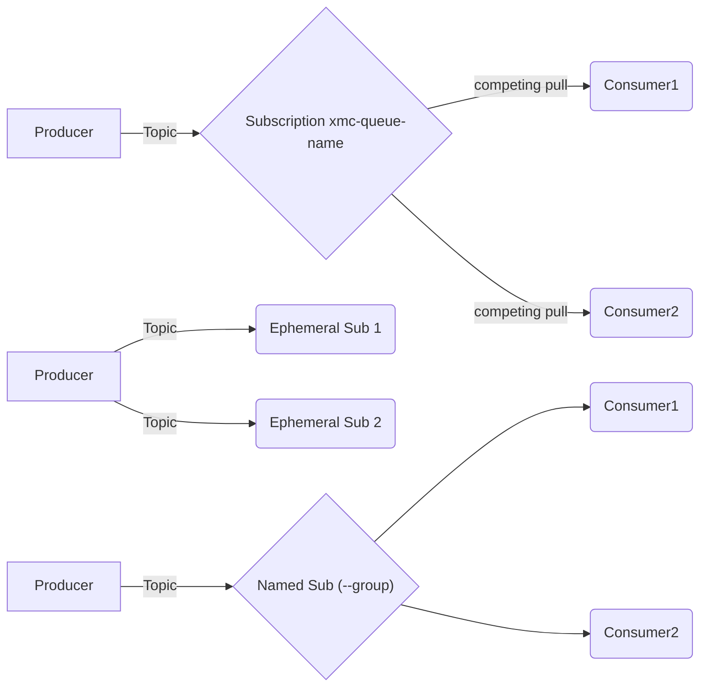
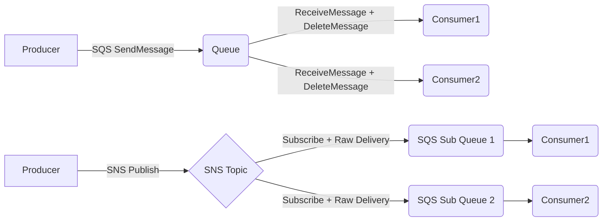
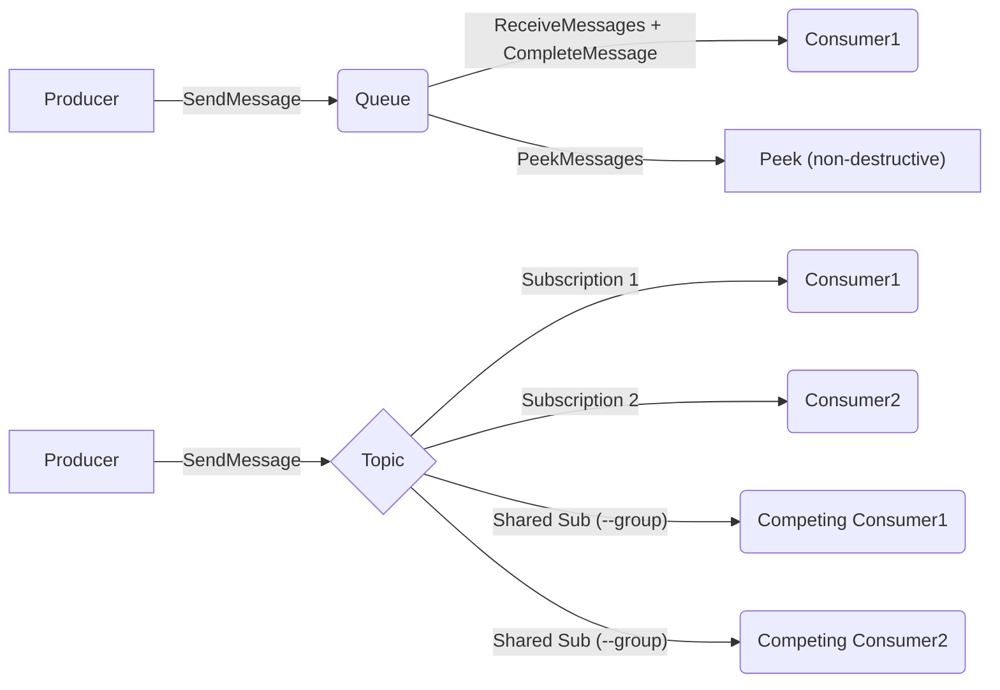

# Differences Between Brokers

## Feature Matrix

| Feature | [Artemis](artemis.md) | [RabbitMQ](rabbitmq.md) | [Kafka](kafka.md) | [IBM MQ](ibmmq.md) | [MQTT](mqtt.md) | [NATS](nats.md) | [Pulsar](pulsar.md) | [Redis](redis.md) | [GCP Pub/Sub](google.md) | [AWS SQS+SNS](aws.md) | [Azure SB](azure.md) |
| --- | --- | --- | --- | --- | --- | --- | --- | --- | --- | --- | --- |
| Queue send/receive/peek | Yes | Yes | - | Yes | Yes | Yes | Yes | Yes | Yes | Yes | Yes |
| Topic publish/subscribe | Yes | Yes | Yes | - | Yes | Yes | Yes | Yes | Yes | Yes | Yes |
| Request-reply | Yes | Yes | - | Yes | Yes | Yes | Yes | Yes | Yes | Yes | Yes |
| Reply / responder | Yes | Yes | - | Yes | Yes | Yes | Yes | Yes | Yes | Yes | Yes |
| Move / redrive | Yes | Yes | - | Yes | Yes | Yes | Yes | Yes | Yes | Yes | Yes |
| Custom output format (`-F`) | Yes | Yes | Yes | Yes | Yes | Yes | Yes | Yes | Yes | Yes | Yes |
| NDJSON export/import (`--ndjson`) | Yes | Yes | Yes | Yes | Yes | Yes | Yes | Yes | Yes | Yes | Yes |
| Drain all (`-n 0`) | Yes | Yes | Yes | Yes | Yes | Yes | Yes | Yes | Yes | Yes | Yes |
| Producer rate limit (`--rate`) | Yes | Yes | Yes | Yes | Yes | Yes | Yes | Yes | Yes | Yes | Yes |
| Connectivity check (`ping`) | Yes | Yes | Yes | Yes | Yes | Yes | Yes | Yes | Yes | Yes | Yes |
| Streaming relay (`forward`) | Yes | Yes | Yes | Yes | Yes | Yes | Yes | Yes | Yes | Yes | Yes |
| Time-bounded streaming (`--for`) | Yes | Yes | Yes | Yes | Yes | Yes | Yes | Yes | Yes | Yes | Yes |
| Live throughput (`--stats`) | Yes | Yes | Yes | Yes | Yes | Yes | Yes | Yes | Yes | Yes | Yes |
| TLS / SSL | Yes | Yes | Yes | - | Yes | Yes | Yes | Yes | - | - | - |
| Message selectors | Yes | Yes | - | Yes | - | - | - | - | - | - | - |
| Durable subscriptions | Yes | Yes | - | - | - | - | Yes | Yes | Yes | Yes | Yes |
| TTL / expiry | Yes | Yes | Partial | Yes | Yes | - | Partial | - | - | - | Yes |
| Application properties | Yes | Yes | Yes | Yes | Yes (MQTT 5) | Yes | Yes | Yes | Yes | Yes | Yes |
| Message priority | Yes | Yes | - | Yes | - | - | - | - | - | - | - |
| Persistent delivery | Yes | Yes | - | Yes | Yes (QoS 1) | Yes (JetStream) | Yes (persistent://) | Yes (Streams) | Yes | Yes | Yes |
| Management: list | Yes | Yes | Yes | - | - | Yes | Yes | Yes | Yes | Yes | Yes |
| Management: purge | Yes | Yes | - | - | - | Yes | - | Yes | Yes (seek) | Yes | Yes (drain) |
| Management: stats | Yes | Yes | Yes (topic) | - | - | Yes | - | Yes | - | Yes | Yes |
| Management: create | queue, topic, address | queue, exchange | topic | - | - | queue | topic | queue, topic | queue, topic | queue, topic | queue, topic |
| Management: delete | queue, topic, address | queue, exchange | topic | - | - | queue | topic | queue, topic | queue, topic | queue, topic | queue, topic |
| Management: bind | queue↔address | queue↔exchange | - | - | - | - | - | - | - | - | - |

The `reply`, `move` and `-F`/`--format` features live in the generic command layer
(`cmd/`) on top of the queue/topic interfaces, so they are available for every broker
that exposes the underlying operation. `reply` and `move` require queue support (hence
unavailable for Kafka), and end-to-end `reply` additionally depends on the broker
conveying a reply-to address (use `--replyto` as a fallback where it does not).
`-F`/`--format` is purely client-side rendering and works for every broker's read commands.

Likewise, `--ndjson` (lossless export/import), `-n 0` (drain), `--rate` (producer rate
limiting) and `ping` (connectivity check) are implemented generically and work for every
broker. `--ndjson` and `--rate` apply wherever the relevant read or write command exists;
`ping` connects via the broker's queue adapter (or its topic adapter for Kafka).

The streaming features are also generic. `forward` relays continuously between two
destinations on the same broker (queue-to-queue for queue brokers, topic-to-topic for
Kafka), with an optional `-x`/`--command` shell command. `--for` (time-bounded streaming) and
`--stats` (live throughput to stderr) apply to every read command and to `forward`, so
any broker can be sampled for a fixed window or monitored for throughput while streaming.

"Message priority" and "Persistent delivery" showing "-" above means the broker has no
native concept for it, not that xmc's support is partial: `--priority`/`--persistent` are
accepted on every broker's send/publish command (so scripts and pipelines don't need
per-broker branching), but on a broker without native support the value is a no-op on
send and is never populated on receive — it will not appear in `-J`/`--ndjson` output or
round-trip through `forward`/`bridge`. Only Artemis, RabbitMQ, and IBM MQ currently honor
both in both directions.

## Metadata Field Mapping

xmc's canonical `Message` fields (`MessageID`, `CorrelationID`, `ReplyTo`, `ContentType`,
plus `Priority`/`Persistent`/`TTL`/`Key`) are mapped **native-first**: whenever a broker's
wire protocol has a dedicated slot for a field, the adapter maps to/from that slot. The
`PropContentType`/`PropCorrelationID`/`PropMessageID`/`PropReplyTo` keys
(`broker/backends/properties.go`) exist only as the interchange convention for brokers
that have no such slot — see the policy comment there. This table is the audit record;
update it when adding a broker or a new canonical field.

| Field | Artemis / RabbitMQ (AMQP) | IBM MQ | Azure SB | Kafka / Pulsar / NATS / Redis / Google / AWS | MQTT |
| --- | --- | --- | --- | --- | --- |
| MessageID | native `Properties.MessageID` | native `MQMD.MsgId` | native `MessageID` | `PropMessageID` (no native slot) | user property `message-id` (MQTT 5; no native slot) |
| MessageID back-fill (sender set none) | — (broker adds no wire ID) | queue manager always assigns `MsgId` | broker `SequenceNumber` | server ID (Google/AWS/Pulsar), stream entry ID (Redis), `stream:seq` (NATS), `topic:partition:offset` (Kafka) | — |
| CorrelationID | native `Properties.CorrelationID` | native `MQMD.CorrelId` | native `CorrelationID` | `PropCorrelationID` | native correlation data (MQTT 5) |
| ReplyTo | native `Properties.ReplyTo` | native `MQMD.ReplyToQ` | native `ReplyTo` | `PropReplyTo` | native response topic (MQTT 5) |
| ContentType | native `Properties.ContentType` | message-handle property under `PropContentType` (MQMD has no content-type slot) | native `ContentType` | `PropContentType` | native content type (MQTT 5) |
| Priority | native `Header.Priority` | native `MQMD.Priority` | unsupported | unsupported | unsupported |
| Persistent | native `Header.Durable` | native `MQMD.Persistence` | unsupported | unsupported | Yes (QoS 1, protocol-level, not a `Message` field) |
| TTL | AMQP header | native `MQMD.Expiry` | native `TimeToLive` | internal transport header, Kafka/Pulsar only (stripped back out on receive, not user-visible); unsupported elsewhere | native message expiry (MQTT 5, seconds) |
| Key (partition/ordering) | n/a | n/a | n/a | native on Kafka/Pulsar; Google `OrderingKey`; AWS `MessageGroupId` (FIFO only, explicit `--message-group-id` wins); dropped on NATS/Redis | n/a |

When the sender sets no message ID, read commands back-fill `MessageID` with the
broker-assigned identity per the back-fill row above — a sender-set ID always wins, and
messages relayed by `move`/`forward`/`bridge` keep their origin ID. Artemis, RabbitMQ,
and MQTT have no back-fill because those brokers put no server-assigned ID on the wire
(AMQP `message-id` is sender-populated; Artemis's internal ID is not exposed over AMQP).

`-K`/`--key` maps to Google Pub/Sub's `OrderingKey` (xmc-created subscriptions enable
ordered delivery; subscriptions created by older versions keep unordered delivery — the
flag is immutable) and to AWS `MessageGroupId` on FIFO queues/topics only (`--message-group-id`
takes precedence; on standard queues the key is dropped as before). Both map back to
`Key` on receive.

## Traditional Message Brokers

### Apache Artemis

- Protocol: AMQP 1.0
- Creates queues on the fly (e.g. when a consumer connects)
- ANYCAST means traditional queues (default), only one consumer
- MULTICAST means topics & subscriptions, multiple consumers
- Selectors: Full JMS selector support via AMQP source filters
- Management: Jolokia REST API on HTTP port 8161 (list, purge, stats, create/delete queue, create/delete topic)

=> Use message metadata for topology selection.

### RabbitMQ

- Protocol: AMQP 1.0 (RabbitMQ v4+)
- AMQP 1.0 address format: v2 (`/queues/<name>`, `/exchanges/<exchange>/<routing-key>`)
- Queues must be pre-declared (RabbitMQ does not auto-create queues over AMQP 1.0)
- Smart addressing defaults: `send` → `/queues/<name>`, `publish` → `/exchanges/amq.topic/<name>`
- Explicit routing: `-e <exchange>` sets the exchange (with optional routing key as `<to>`), `-q <queue>` forces queue routing
- Full v2 addresses (starting with `/`) are always used verbatim (highest precedence); reserved characters in names/keys are percent-encoded like the official RabbitMQ clients
- `subscribe`: AMQP 1.0 v2 forbids exchange sources, so xmc declares a backing queue via the Management API (`<group>.<key>` durable for groups, `xmc-durable-<key>` for `--durable`, expiring `xmc-sub-<random>` for group-less runs), binds it with the topic as binding key, and consumes from it
- Choose between `fanout`, `direct`, `topic` and `headers` exchange types
- Selectors: Supported via AMQP source filters
- Management: RabbitMQ Management API on HTTP port 15672 (list, purge, stats, create/delete queue, create/delete exchange, bind/unbind queue); also required by `subscribe` and the `peek -n 0` browse cursor

=> Define topology statically by declaring exchanges, queues, and bindings.

### IBM MQ

- Protocol: IBM MQ native (requires IBM MQ client libraries)
- Queue-only operations (no topic support in imc)
- Binary name: `imc` (built via `build-imc-in-container.sh` or with `-tags ibmmq`)
- Connection flags include `--qmgr/-m` (queue manager) and `--channel/-c`
- Selectors: IBM MQ message selector support
- TTL: Uses MQMD Expiry field (tenths of a second, converted from ms)
- No management commands (use IBM MQ Explorer or `runmqsc`)
- Build requires IBM MQ SDK/client libraries (platform-specific)

## Streaming Brokers

### Kafka

- Protocol: Kafka native
- Has its own concepts & domain language, which differs from traditional
  messaging and Enterprise Integration Patterns (EIP)
- Always uses topics, no queues
- Always persists messages, ability to replay messages
- TTL: Set as a message header (broker-side retention handles expiry)
- Consumer groups for parallel processing (`--group/-g`)
- Message keys for partitioning (`--key/-K`)
- Management: Topic listing, create/delete topic via admin client (`--partitions`, `--replication-factor`, `--config`)
- **Gotcha**: `-s` is only the bootstrap URL. `publish`/`subscribe`/`manage list`
  (consumer groups) reconnect to each broker's *advertised* address from cluster
  metadata, not `-s`. A broker started with a container hostname but no explicit
  advertised listener (e.g. `--hostname kafka` without
  `KAFKA_ADVERTISED_LISTENERS`) will advertise `kafka:9092`, which is unreachable
  from the host — `manage create/delete-topic` and `manage list` (topics) still
  work because they use a single connection to the bootstrap URL, but
  publish/subscribe/consumer-group listing fail with a DNS error. Fix by setting
  `KAFKA_ADVERTISED_LISTENERS=PLAINTEXT://localhost:9092` (or the reachable
  hostname) on the broker.

### MQTT

- Protocol: MQTT 5 by default; `--mqtt-version 3` selects the legacy 3.1.1 client for old brokers (no properties/metadata — send/publish reject the flags loudly)
- MQTT 5 metadata: user properties (`-P`), content type, correlation data, response topic, message expiry (`-E`, seconds)
- Binary: `mmc`, build tag: `mqtt`
- **Queue topology**: send publishes to `queue/{name}` with QoS 1; receive uses MQTT 5.0 shared subscriptions (`$share/xmc/queue/{name}`) for competing consumers; peek subscribes directly without a shared subscription using a fresh clean-session client.
- **Topic topology**: publish/subscribe to MQTT topics directly. Consumer groups via `--group` map to shared subscriptions (`$share/{groupID}/{topic}`).
- TLS: auto-detected via `ssl://` URL scheme or `--tls` flag
- `--client-id` flag: optional, auto-generated if not set
- QoS 0 = non-persistent, QoS 1 = persistent (maps to `--persistent` flag)
- Default server: `tcp://localhost:1883` (env: `MMC_SERVER`)
- Library: `github.com/eclipse/paho.mqtt.golang`

### NATS

- Protocol: NATS Core / JetStream
- Binary: `nmc`, build tag: `nats`
- **Queue topology**: JetStream streams with WorkQueue retention — each message delivered to exactly one consumer. Streams are auto-created on first use (`XMC_Q_{QUEUENAME}`). Peek uses a pull consumer with nak (no acknowledgement) so messages are not consumed.
- **Topic topology**: Core NATS pub/sub subjects. Consumer groups via `--group` flag map to NATS queue subscribers (`QueueSubscribeSync`).
- Request-reply: supported using NATS reply subjects
- TLS: standard flags (`--tls`, `--ca-cert`, `--cert`, `--key-file`, `--insecure`)
- Management: `manage list` enumerates JetStream streams (= queues), `manage create-queue` / `manage delete-queue` (with `--retention`, `--max-msgs`, `--subject`)
- Default server: `nats://localhost:4222` (env: `NMC_SERVER`)
- Requires JetStream enabled on the server (`--jetstream` flag or `jetstream {}` in server config) for queue operations
- Library: `github.com/nats-io/nats.go`

### Apache Pulsar

- Protocol: Pulsar native (binary protocol, port 6650)
- Binary: `pmc`, build tag: `pulsar`
- **Queue topology**: Shared subscription on `persistent://public/default/{queue}` — messages distributed among all subscribers with the same subscription name, each delivered to exactly one consumer.
- **Topic topology**: `--group` maps to a Shared durable subscription for load-balanced consumer groups; `--durable` (without group) to an Exclusive durable one. Group-less subscribes use an Exclusive NonDurable subscription with a unique per-run name, so no cursor is left on the topic and concurrent subscribers don't collide.
- Peek: uses Shared subscription + Nack so messages are redelivered and not consumed
- Request-reply: via ReplyTo topic property
- TLS: auto-detected via `pulsar+ssl://` URL scheme; also `--tls` flag
- Authentication: token-based via `--password` (JWT); TLS client certificate via `--cert`/`--key-file`
- Management: Pulsar Admin REST API (HTTP port 8080, `--admin-port` to override) — list, create/delete topic (with `--partitions`)
- Default server: `pulsar://localhost:6650` (env: `PMC_SERVER`)
- Tenant/namespace: defaults to `persistent://public/default/`

### Redis

- Protocol: Redis Streams + consumer groups
- Binary: `redmc`, build tag: `redis`
- **Queue topology**: Redis Streams (`xmc:queue:{name}`) with a single consumer group (`xmc-queue`). `XADD` to send, `XREADGROUP` + `XACK` + `XDEL` to receive (true work-queue semantics). Peek uses `XRANGE` (non-destructive, no ack needed).
- **Topic topology**: Also Redis Streams (`xmc:topic:{name}`) with `MAXLEN ~ 10000` approximate trimming. Independent subscribers use `XREAD` starting from `$` (new-messages-only fan-out, each subscriber tracks its own offset). `--group` maps to consumer groups (`XREADGROUP` + `XACK`, competing consumers within the group). `--durable` groups persist their read offset across reconnections.
- TLS: auto-detected via `rediss://` URL scheme or `--tls` flag
- Application properties: stored with a `p:` prefix in stream entry fields to avoid colliding with reserved metadata fields (`data`, `message-id`, `correlation-id`, `reply-to`, `content-type`)
- Management: `manage list` scans `xmc:queue:*` and `xmc:topic:*` keys; `manage purge` deletes the stream key; `manage stats` uses `XLEN` + `XINFO GROUPS`; `manage create-queue`/`create-topic` creates stream (+ consumer group for queues); `manage delete-queue`/`delete-topic` deletes the stream key
- Default server: `redis://localhost:6379` (env: `REDMC_SERVER`)
- Library: `github.com/redis/go-redis/v9`
- **Limitations**: no per-message TTL on streams (Streams have no built-in per-entry expiry); topic Pub/Sub channels are not used (Streams provide persistence and metadata that Pub/Sub lacks)

### Google Cloud Pub/Sub

- Protocol: gRPC (Google Cloud Pub/Sub API)
- Binary: `gmc`, build tag: `google`
- **Queue topology**: A topic + a single shared subscription (`xmc-queue-{name}`) — messages are distributed among competing consumers, each delivered to exactly one. The subscription is auto-created on first `send` so messages are retained before the first `receive`.
- **Topic topology**: Ephemeral per-subscriber subscriptions for true fan-out (auto-deleted on close). `--group` maps to a stable subscription named `{group}-{topic}` — subscription IDs are project-global, so the topic scopes the name (competing consumers within the group). `--durable` uses a persistent subscription that retains its read position. An existing same-named subscription bound to another topic is rejected with a clear error rather than silently delivering that topic's messages.
- Peek: uses `Nack` so messages are redelivered
- Authentication: Google Application Default Credentials (ADC) or `--credentials` (service account JSON). No TLS flags (gRPC handles transport).
- Emulator: set `--endpoint` (or env `PUBSUB_EMULATOR_HOST`) for local development
- Management: `manage list` enumerates topics and subscriptions. No purge/stats in v1 (purge requires SeekToTime; stats need Cloud Monitoring API).
- Default project: env `GMC_PROJECT`; no default server (uses Google Cloud)
- Library: `cloud.google.com/go/pubsub`
- **Limitations**: no per-message TTL (retention is subscription-level); no `manage stats` (requires Cloud Monitoring API)

### AWS SQS + SNS

- Protocol: AWS SDK v2 (HTTPS REST APIs)
- Binary: `awsmc`, build tag: `aws`
- **Queue topology**: SQS queues (native point-to-point). `CreateQueue` is idempotent. `ReceiveMessage` + `DeleteMessage` = ack. Peek uses `VisibilityTimeout: 0` + `ChangeMessageVisibility` so the message is not consumed.
- **Topic topology**: SNS topics with SNS→SQS fan-out. Each subscriber gets an auto-created SQS queue subscribed to the SNS topic with `RawMessageDelivery: true` (preserves payload + message attributes). `--group` maps to a shared SQS queue named `{group}-{topic}` — queue names are account-global, so the topic scopes the name (competing consumers). Group/durable subscriber queues stay SNS-subscribed after exit and keep buffering; ephemeral ones are unsubscribed and deleted on close.
- Application properties: carried as SQS/SNS `MessageAttributes` (`DataType: "String"`). The four metadata keys (`message-id`, `correlation-id`, `reply-to`, `content-type`) are reserved attributes.
- Authentication: standard AWS credential chain (env vars / shared config / IAM). `--region`, `--endpoint` (for LocalStack), `--profile`.
- Management: `manage list` (SQS `ListQueues` + SNS `ListTopics`), `manage purge` (native `PurgeQueue`), `manage stats` (`GetQueueAttributes` for message counts)
- Default region: `us-east-1` (env: `AWSMC_REGION`)
- Library: `github.com/aws/aws-sdk-go-v2`
- **Limitations**: no per-message TTL (SQS retention is queue-level); default reply queue name `xmc.reply` contains a dot which SQS doesn't allow — use `--reply-to xmc-reply` (or any alphanumeric/hyphen/underscore name)

### Azure Service Bus

- Protocol: AMQP 1.0 (via Azure SDK)
- Binary: `azmc`, build tag: `azure`
- **Queue topology**: Native Service Bus queues. `NewSender` + `SendMessage` to send; `NewReceiverForQueue` + `ReceiveMessages` + `CompleteMessage` to receive (ack). **Native `PeekMessages`** — the only broker alongside Service Bus with true non-destructive peek at the API level.
- **Topic topology**: Native Service Bus topics + subscriptions. Each subscriber gets a subscription; `--group` maps to a shared subscription name (competing consumers). `--durable` creates a persistent subscription. Ephemeral subscriptions are deleted on close.
- **Native per-message TTL**: `TimeToLive` field on the message (maps to `--ttl`). This is the only cloud broker with first-class per-message expiry.
- Application properties: carried in Service Bus `ApplicationProperties` (native `map[string]any`). Message metadata (`MessageID`, `CorrelationID`, `ReplyTo`, `ContentType`) maps to first-class Service Bus message fields (not custom properties).
- Authentication: `--connection-string` (SAS, primary) or `--namespace` (Azure AD via `DefaultAzureCredential` / managed identity / `az login`).
- Management: `manage list` (admin pager APIs for queues/topics), `manage stats` (`GetQueueRuntimeProperties` for active/total message counts), `manage purge` (drains via `ReceiveModeReceiveAndDelete` — no native purge API)
- Default: env `AZMC_CONNECTION_STRING` or `AZMC_NAMESPACE`
- Library: `github.com/Azure/azure-sdk-for-go/sdk/messaging/azservicebus` + `azidentity`
- **Limitations**: `manage purge` is implemented by draining (no native purge API); entities must be pre-created or XMC auto-creates them (needs Manage claim on the connection string)

